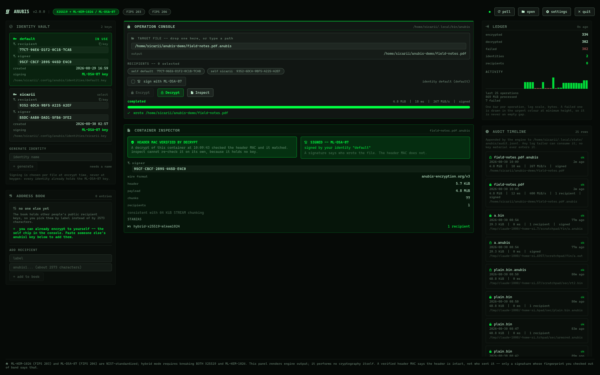
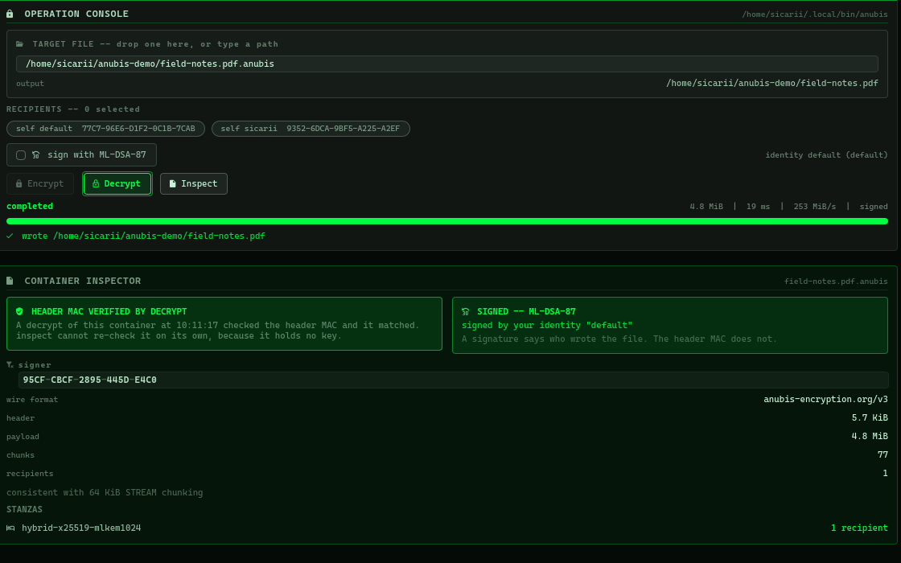
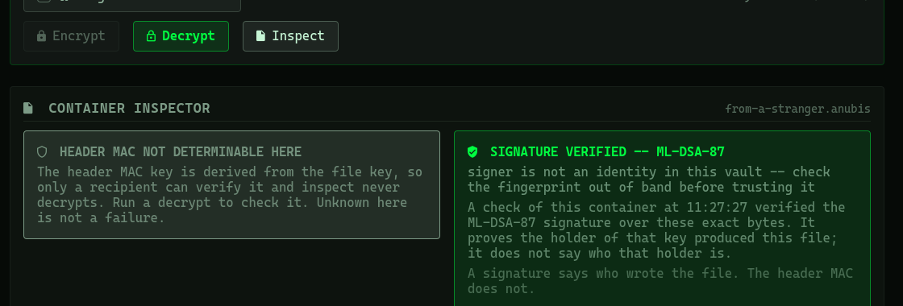
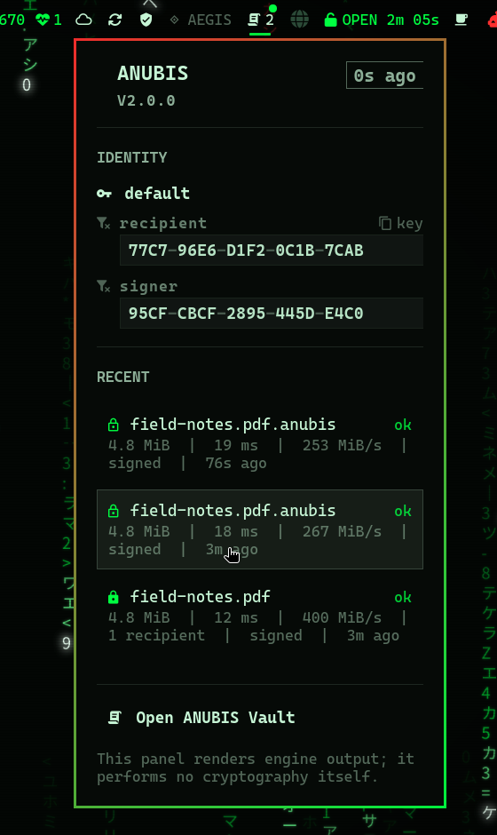

# ANUBIS

Post-quantum file encryption. Hybrid X25519 + ML-KEM-1024 key encapsulation,
optional ML-DSA-87 signatures, ChaCha20-Poly1305 payloads.

**Zero system dependencies -- no liboqs, no OpenSSL, no cmake.** Every
cryptographic primitive is a pure-Rust implementation, so `cargo install` works
on a stock Arch or Omarchy system with nothing but a Rust toolchain.

Wire format `ANUBIS/v3`. Software version 2.1.0. Those numbers differ on
purpose; see [Version numbering](#version-numbering).

One repository, three surfaces:

| | |
|---|---|
| `crates/` | the engine -- `anubis-crypto` and the `anubis` CLI |
| `desktop/` | **ANUBIS Vault**, the standalone Qt 6 desktop application |
| `plugin/` | `khephri.anubis`, the Omarchy bar readout |



---

## What it is

A command-line tool that encrypts a file to one or more recipients, such that
decryption requires breaking **both** X25519 and ML-KEM-1024. Its header format
is deliberately close to `age`: short, text, line-oriented, one stanza per
recipient.

It exists because its predecessor, `anubis-rage` 1.4.0, obtained its
post-quantum primitives from liboqs, a C library that is not in the Arch
repositories and could not be installed on Omarchy at all. This is a rewrite
against pure-Rust FIPS 203 and FIPS 204 implementations, with the same
algorithms at the same parameter sets.

What it is not: a key management system, a passphrase-based encryptor, a PGP
replacement, or audited software. Read [Security posture](#security-posture)
before relying on it.

---

## Install

```sh
git clone https://github.com/AnubisQuantumCipher/anubis
cd anubis
./install.sh
```

`install.sh` builds with cargo, installs `anubis` to `~/.local/bin`, creates
`~/.config/anubis/identities` at mode 700 and `~/.local/state/anubis`, copies
the `khephri.anubis` plugin files into `~/.config/omarchy/plugins/`, and
registers the bar widget after backing up `shell.json` (registration needs
`jq`; without it the manual one-line edit is printed instead). It is
idempotent; re-running it only fills in what is missing.

The desktop application installs separately -- it needs Qt 6, which the engine
deliberately does not:

```sh
cd desktop && ./install.sh
```

See [`desktop/README.md`](desktop/README.md) for what that gives you: the app
in the launcher, `.anubis` containers opening on double-click with their own
icon, and Nautilus context-menu entries.

Or, without the Omarchy integration:

```sh
cargo install --path crates/anubis-cli
```

Arch users can build a package from `packaging/PKGBUILD`:

```sh
cd packaging && makepkg -si
```

Note that the PKGBUILD builds the released `v2.1.0` tag fetched from GitHub --
the standard Arch practice -- not whatever state your working tree is in.

Ensure `~/.local/bin` is on your `PATH`. Shell completions are not installed by
`install.sh`; generate them with `anubis completions <shell>` (see
[Shell completions](#shell-completions)). The Arch package installs the bash,
zsh, and fish scripts for you.

---

## Quick start

```sh
# 1. Generate an identity. Decrypts and signs; one file, no separate signing key.
anubis keygen --name default

# 2. Encrypt to a recipient.
anubis encrypt --recipient anubis1... --sign notes.txt --output notes.txt.anubis

# 3. Decrypt. Reports the signer fingerprint when the file is signed.
anubis decrypt --identity default notes.txt.anubis --output notes.txt

# 4. Inspect a file without decrypting it. Armor is detected; `-` reads stdin.
anubis inspect notes.txt.anubis

# 5. Decrypt again, this time refusing anything not signed by that key.
anubis decrypt --signer 95CF-CBCF-2895-445D-E4C0 notes.txt.anubis --output notes.pinned.txt

# 6. See identities, recipients, and recent operations.
anubis status

# 7. Shell completions, to stdout.
anubis completions bash
```

Encrypt to yourself in one step:

```sh
ME="$(anubis status --json | jq -r '.identities[0].recipient')"
anubis encrypt -r "$ME" --sign backup.tar -o backup.tar.anubis
```

Multiple recipients. `-r` takes either a full `anubis1...` key or a label from
the address book, so you name people rather than pasting 2573-character keys:

```sh
anubis encrypt -r anubis1alice... -r anubis1bob... report.pdf -o report.pdf.anubis

# Save a recipient once under a label, then use the label.
anubis recipient add anubis1alice... --label alice
anubis recipient list
anubis encrypt -r alice -r bob report.pdf -o report.pdf.anubis
```

`-R`/`--recipients-file` reads recipients from a file, one per line. Blank
lines and `#` comments are ignored; every other line must begin `anubis1`, and
a line that does not is a fatal error naming the file and line number. `-R` is
repeatable and combines freely with `-r`:

```sh
cat > team.txt <<'EOF'
# platform team, fingerprints confirmed by voice
anubis1alice...
anubis1bob...
EOF

anubis encrypt -R team.txt -r anubis1carol... report.pdf -o report.pdf.anubis
```

A bad line is reported and nothing is written:

```
anubis: team.txt:4: expected a recipient beginning 'anubis1'
```

**Duplicate recipients are de-duplicated** by the CLI before encryption, so
naming the same key through both `-r` and `-R`, or twice in one file, costs one
stanza rather than two.

### Streams: `-` is stdin and stdout

Both `encrypt` and `decrypt` accept `-` as the input argument and as
`--output`. When the input is `-` and no `--output` is given, the output
defaults to stdout, so ANUBIS drops into a pipeline with no scratch file:

```sh
tar cf - -C /tmp somedir | anubis encrypt -r "$ME" --sign -o - - > out.anubis
anubis decrypt -o - - < out.anubis | tar xf - -C /tmp
```

This holds for signed containers on a genuinely non-seekable pipe too --
`cat out.anubis | anubis decrypt -o - -` -- because the reader peels the fixed
4627-byte signature trailer with a delay buffer instead of seeking. `inspect`
also accepts `-`.

**Memory is constant in every combination of file or pipe input with file or
stdout output, and does not grow with the file.** Measured on this machine at
256 MiB, sampling `VmHWM` from `/proc` over three runs of each of the eight
cases: every one peaked between 3316 kB and 3740 kB, so under 3.7 MiB for a
256 MiB payload. The pipeline above is a supported pattern at any size.

**And decrypt never emits a byte until the whole container has verified,**
including the signature and any `--require-signature`/`--signer` policy. When
the destination is stdout, plaintext is streamed into an unlinked scratch file
in `TMPDIR` -- created and immediately removed, so no other process can see it
and nothing survives a crash -- and copied to stdout only after everything
checks out. Corrupting the last chunk of a 256 MiB container and decrypting to
stdout emits zero bytes and exits 1, signed and unsigned alike. The one
resource this costs is **temporary disk space equal to the plaintext**, not
memory. If `TMPDIR` is not writable the tool falls back to holding the
plaintext in memory, which is slower on space but never less safe; verified by
pointing `TMPDIR` at an unwritable directory and getting byte-identical output.

Omitting `-o` on a *file* input still derives the output path rather than
writing to stdout: `encrypt` appends `.anubis`, or `.anubis.txt` when armoring;
`decrypt` strips either suffix.

```sh
anubis encrypt -r "$ME" notes.txt            # writes notes.txt.anubis
anubis decrypt --identity default notes.txt.anubis   # writes notes.txt
```

Writing binary ciphertext to a terminal is refused outright, since it only ever
corrupts a scrollback:

```
anubis: refusing to write binary ciphertext to a terminal; redirect to a file, pipe it, or pass --armor
```

To encrypt a directory, archive it first, since the format encrypts a single
byte stream and carries no filenames or permissions. Stage a tarball or pipe
one:

```sh
tar cf - ~/Documents | anubis encrypt -r "$ME" --sign -o docs.anubis -
anubis decrypt --identity default -o - docs.anubis | tar xf -
```

### ASCII armor

`-a`/`--armor` on `encrypt` wraps the container in PEM-style boundaries with
base64 wrapped at 64 columns, for email, chat, or copy-paste:

```sh
anubis encrypt -r "$ME" --sign --armor notes.txt   # writes notes.txt.anubis.txt
head -1 notes.txt.anubis.txt                       # -----BEGIN ANUBIS ENCRYPTED FILE-----
tail -1 notes.txt.anubis.txt                       # -----END ANUBIS ENCRYPTED FILE-----
```

The default output suffix becomes `.anubis.txt` rather than `.anubis`, and
armored output is created at mode 0600.

`decrypt` and `inspect` **auto-detect** armor. There is no `--armor` flag on
either, and none is needed:

```sh
anubis decrypt notes.txt.anubis.txt -o notes.txt
anubis inspect notes.txt.anubis.txt
```

**Armor is not streaming and it is size-capped at 16777216 bytes (16 MiB) of
armored text.** The armored text is buffered and base64-decoded whole before
any key is involved, so the cap bounds unauthenticated work rather than
expressing a preference. Binary encrypt and decrypt are constant-memory at any
size; armor is not. **Use binary output for anything large.**

Both directions measure the same quantity against the same limit, so a file
that armors is a file that reads back. `encrypt --armor` refuses an input whose
armored output would exceed the cap, and `decrypt` and `inspect` refuse armored
input over it:

```
anubis: 20000000 bytes is too large to armor (armored output would exceed the 16777216 byte limit); omit --armor for binary output
anubis: armored input exceeds 16777216 bytes; use binary for large files
```

Nothing is written when `encrypt --armor` refuses. The boundary is exact and
measured on this machine: 12383906 bytes of plaintext armors to exactly
16777216 bytes and round-trips byte-for-byte; 12383907 bytes is refused. So the
practical guidance is **keep armored plaintext under about 11.8 MiB**, and
reach for binary above it.

The cap does its job cheaply. A 256 MiB armored file offered to `decrypt` is
refused after peaking well under 20 MiB resident: 14.3 MiB to 19.5 MiB across
six runs, sampling `VmHWM` from `/proc`.

### Signature policy on decrypt

A signature present in a container is always verified, and `decrypt` fails if
verification fails. Two flags turn that into a *requirement*:

```sh
# Exit 1 if the container is not signed at all.
anubis decrypt --require-signature report.anubis -o report.pdf

# Exit 1 unless it is signed by exactly this signer. Implies --require-signature.
anubis decrypt --signer 95CF-CBCF-2895-445D-E4C0 report.anubis -o report.pdf
```

`--signer` comparison ignores the group dashes and letter case, so
`95cfcbcf2895445de4c0` and `95CF-CBCF-2895-445D-E4C0` are the same pin. On a
mismatch, or on an unsigned container, the exit status is 1 and **no plaintext
is written**:

```
anubis: signed by 95CF-CBCF-2895-445D-E4C0, not the pinned signer AAAA-BBBB-CCCC-DDDD-EEEE
anubis: container is unsigned and a signature was required (--require-signature / --signer)
```

Signer attribution is reported wherever it is known:

```sh
anubis decrypt report.anubis -o report.pdf
# decrypt: report.anubis -> report.pdf (..., signature verified, signer 95CF-CBCF-2895-445D-E4C0)

anubis decrypt report.anubis -o report.pdf --json | jq -r .signer_fingerprint
anubis inspect report.anubis --json            | jq -r .signer_fingerprint
anubis status --json | jq -r '.identities[].signing_fingerprint'
```

`signer_fingerprint` is `null`, never `false` or empty, when a container is
unsigned.

**Recipient fingerprints and signer fingerprints are different namespaces over
different keys.** One identity has both and they do not match: the identity
used to verify this document has recipient fingerprint
`77C7-96E6-D1F2-0C1B-7CAB` and signing fingerprint `95CF-CBCF-2895-445D-E4C0`.
Never compare one to the other, and never pass a recipient fingerprint to
`--signer`. `status --json` exposes them as separate fields, `fingerprint` and
`signing_fingerprint`, so that a script cannot conflate them by accident.

**Check the exit status** anyway. A non-zero exit means the output is not
authentic. In practice nothing is produced on failure -- a file destination is
written as a temporary and renamed only after the payload authenticates and the
signature policy passes, and a stdout destination is withheld the same way, so
a failed decryption emits nothing to a path or a pipe. But that is behaviour of
this implementation, not a promise of the file format, and a shell pipeline
silently discards a failure unless something checks. Use `set -o pipefail`, or
test `$?`.

### Verify a recipient before you trust it

A recipient is 2573 characters, which is too long to compare by eye, and at
that length Bech32's guaranteed error detection no longer holds. Every
recipient therefore has an 80-bit fingerprint for out-of-band confirmation:

```
ANUBIS-FP: 3F2A-91C7-04BE-D5A8-6612
```

Confirm that over a channel an attacker does not control -- in person, by
voice, by an already-authenticated channel -- before encrypting anything real.
Accepting a recipient from an untrusted channel means encrypting to whoever
supplied it.

---

## Commands

| Command | Purpose |
|---|---|
| `anubis keygen` | Generate an identity; prints its recipient and fingerprint |
| `anubis encrypt` | Encrypt to one or more recipients, optionally signing and armoring |
| `anubis decrypt` | Decrypt with an identity; verifies any signature present |
| `anubis inspect` | Report a file's format, stanzas, signer, and size without decrypting |
| `anubis verify` | Check a signature. Needs no key, decrypts nothing, works on a container addressed to somebody else |
| `anubis status` | Identities, known recipients, recent operations, counts |
| `anubis recipient` | Address book: `list`, `add KEY --label L`, `remove --label L` |
| `anubis completions` | Emit a completion script for `bash`, `zsh`, `fish`, `elvish`, or `powershell` |

Flags, in full:

| Command | Flags |
|---|---|
| `keygen` | `--name NAME` `--force` |
| `encrypt` | `-r/--recipient KEY_OR_LABEL` `-R/--recipients-file FILE` `--sign` `--identity NAME` `-a/--armor` `-o/--output PATH` `--force` |
| `decrypt` | `--identity NAME` `-o/--output PATH` `--force` `--require-signature` `--signer FINGERPRINT` |
| `inspect` | (no flags beyond `--json`) |
| `verify` | `--signer FINGERPRINT` |
| `status` | (no flags beyond `--json`) |
| `recipient` | `list`, `add KEY --label L`, `remove --label L` |
| `completions` | positional `SHELL` |

`-r` and `-R` are both repeatable. A present signature is verified
automatically on `decrypt`; `--require-signature` and `--signer` add a policy
on top of that, and `--signer` implies `--require-signature`. Armor is
auto-detected on read, so there is no `--armor` on `decrypt` or `inspect`. `-`
means stdin or stdout for `encrypt`, `decrypt`, `inspect`, and `verify`.

`verify` is the standalone check, and it needs **no key at all**: the
signature covers a digest of the header and the payload ciphertext, and the
verifying key travels in the header. So anyone holding the bytes can establish
who produced them, including a third party who cannot decrypt the container
and should not be able to. It streams, so a file larger than memory or
arriving on a pipe is fine.

```sh
anubis verify report.anubis
anubis verify --signer 95CF-CBCF-2895-445D-E4C0 report.anubis   # pin the signer
```

Exit `0` only when a signature is present **and** valid **and**, if pinned, by
that signer. An unsigned container exits non-zero: any recipient can strip a
signature, so "nothing to check" is not a pass. See
[docs/VERIFYING.md](docs/VERIFYING.md) to do the same check with stock OpenSSL
and no ANUBIS code at all.

Every command accepts `--json` and emits single-line JSON objects on stdout.
That surface is stable and is what the GUI consumes.

```sh
anubis status --json | jq '{version, kem: .suite.kem, ids: [.identities[].name]}'
anubis inspect f.anubis --json | jq '{format, signed, signer_fingerprint, payload_bytes, chunks}'
anubis status --json | jq -r '.identities[] | "\(.name) recipient=\(.fingerprint) signer=\(.signing_fingerprint)"'
anubis encrypt -r "$ME" big.iso -o big.iso.anubis --json \
  | jq -c 'select(.kind=="progress") | .pct'
```

The `format` field carries the full version line, `anubis-encryption.org/v3`.

`signer_fingerprint` appears on `decrypt` and `inspect` results, and is `null`
when the container is unsigned. `status --json` carries `signing_fingerprint`
per identity alongside the recipient `fingerprint`; the two are over different
keys and are never interchangeable.

`inspect` reports `header_mac_ok` as `null`, not `false`, because it does not
decrypt: the header MAC key is derived from the file key, so only a recipient
can verify it. Treat `null` as "not checked", never as "failed". A successful
`decrypt --json` reports `header_mac_ok: true`.

`inspect` reports `signature_ok` as `null` for the same reason in a different
key: checking a signature means hashing the whole payload, which `inspect`
does not do. `verify --json` emits exactly one `{"kind":"verify"}` object
carrying `ok`, `signed`, `signature_ok`, `signer_fingerprint`,
`signer_matches`, and the size fields. Its `signature_ok` is `true`, `false`,
or `null`, and all three are distinct: `null` means the check could not be
made -- unsigned, truncated, malformed -- and is never a pass and never a
failure. `header_mac_ok` on a verify record is always `null`, because that
command holds no key.

Exit codes: `0` success, `1` operation failure (bad key, tamper detected,
unsigned container under `--require-signature`, signer mismatch, armor over the
cap, IO), `2` usage error.

### Shell completions

```sh
anubis completions bash > ~/.local/share/bash-completion/completions/anubis
anubis completions zsh  > ~/.local/share/zsh/site-functions/_anubis
anubis completions fish > ~/.config/fish/completions/anubis.fish
```

`elvish` and `powershell` are also accepted. The script goes to stdout, so
redirect it where your shell looks. The Arch package in `packaging/PKGBUILD`
installs the bash, zsh, and fish scripts system-wide, so package users need
none of the above.

---

## Desktop application

**ANUBIS Vault** (`desktop/`) is the GUI: a standalone Qt 6 application with a
three-rail cockpit -- identities and the address book keyed by fingerprint, an
operation console with live streaming progress and an overwrite gate, the
container inspector, and the audit timeline. It spawns the `anubis` binary,
reads its JSON, and draws it; it holds no key material and reaches no
verification verdict of its own. One instance: opening a container from a file
manager hands the path to the vault already running.



Signature checking needs no key, so the vault offers it on a container it
cannot open. Here the header MAC stays honestly undeterminable -- that one does
need a key -- while the signature is verified anyway:



It is documented in [`desktop/README.md`](desktop/README.md) and installed
with `desktop/install.sh`, which also registers the
`application/vnd.anubis.container` MIME type (so sealed files carry their own
icon and open in the vault) and a Nautilus context-menu extension
(*Encrypt with ANUBIS...*, *Encrypt to myself*, *Decrypt with ANUBIS*).

---

## Omarchy plugin

The bar surface, `khephri.anubis` (`plugin/`), is a READOUT: a compact bar
indicator and a dropdown that answer the questions you would otherwise open
the app for -- engine state, identity and recipient fingerprints, recent
operations -- and hand you the app for everything else. It performs no
operation of its own; everything that changes state lives in the desktop
application, one click away.



Until v2.0.0 the plugin carried a full-screen cockpit near-identical to the
application's. Two copies of one honesty-audited surface with nothing keeping
them in sync is a defect waiting to happen, so the plugin was cut down to the
one job a bar surface is good at. The old cockpit QML is archived under
`desktop/reference/`.

`install.sh` copies the plugin files into `~/.config/omarchy/plugins/` and
registers the widget in `~/.config/omarchy/shell.json` by appending
`khephri.anubis` to `bar.layout.right`, writing a timestamped backup first and
skipping the edit if the entry is already present. Registration needs `jq` and
an existing `shell.json`; when either is missing the installer prints the
manual step rather than guessing at an edit.

To register it manually, add to the `right` array in `bar.layout`:

```json
{ "id": "khephri.anubis" }
```

Then reload:

```sh
omarchy-shell shell rescanPlugins
```

---

## Audit stream

ANUBIS appends one JSON object per operation to
`~/.local/state/anubis/audit.jsonl`, an append-only stream in the same
`{ts, op, path, out, bytes, ms, ok, signed, recipients, error}` shape that
`anubis status --json` reports under `recent`.

No key material, no identity strings, no recipient secrets, and no plaintext
ever enter the audit stream. It records paths, sizes, timings, and outcomes.
That is deliberate: the stream is meant to be readable by another process, so
it must contain nothing that would be dangerous to read.

The desktop application renders it as the audit timeline, and any log tailer
can consume it. If you run [SIA](https://github.com/AnubisQuantumCipher/sia),
the Omarchy machine-memory daemon, two `custom_senses` entries tailing that
file make encryption operations part of the machine's recallable memory. One
implementation detail is easy to get wrong: SIA's `sense_custom` applies its
match regex to the *extracted field*, not to the raw JSON line, so key the
success and failure senses on the extracted summary text -- the `ok` boolean
is never visible to the regex.

---

## Crypto suite

| Component | Algorithm | Standard | Crate |
|---|---|---|---|
| Classical KEM | X25519 | RFC 7748 | `x25519-dalek` |
| Post-quantum KEM | ML-KEM-1024 | FIPS 203 | `ml-kem` |
| KEM combiner | HKDF-SHA-512, transcript-bound | RFC 5869 | `hkdf` |
| Signatures (optional) | ML-DSA-87 | FIPS 204 | `ml-dsa` |
| AEAD | ChaCha20-Poly1305, STREAM, 64 KiB chunks | RFC 8439 | `chacha20poly1305` |
| Header MAC | HMAC-SHA-512 | RFC 2104 | `hmac`, `sha2` |
| Key encoding | Bech32 | BIP-173 | `bech32` |

Recipients are `anubis1...` (1600-byte payload). Identities are
`ANUBIS-SECRET-KEY-1...` (128-byte payload, 230 characters) and are
capability-complete: one identity both decrypts and signs.

The KEM combiner binds the full recipient transcript into the HKDF salt:

```
wrap_key = HKDF-SHA512(salt = x25519_epk || mlkem_ct,
                       ikm  = x25519_ss  || mlkem_ss,
                       info = "anubis-hybrid-v2/X25519+MLKEM-1024")
```

Binding the transcript is what makes the combiner IND-CCA2 secure when either
component is, and what prevents ciphertext-substitution and re-encapsulation
attacks. `docs/FORMAT.md` section 5.3 explains why in full.

**Overhead.** A single-recipient header is 2344 bytes unsigned, 5812 signed.
Signing also appends a 4627-byte ML-DSA-87 signature as a trailer at the end of
the file, so signing costs a fixed 8095 bytes in total. Payloads add 16 bytes
per 64 KiB chunk. A 1 MiB file becomes 1051176 bytes unsigned, 1059271 signed.
Do not encrypt many tiny files individually; the fixed header dominates, and a
1 KiB file becomes 3384 bytes. Encrypt an archive.

**Speed and memory, measured on this machine (aarch64).** A 256 MiB plaintext
signs and encrypts in 0.50 s and decrypts with signature verification in
0.55 s, producing a 268511431-byte signed container: 75975 bytes of overhead on
268435456 bytes of plaintext. Resident memory does not scale with the file at
all. Sampling `VmHWM` from `/proc`, three runs of each of the eight
combinations of `encrypt`/`decrypt` with file or pipe input and file or stdout
output, every case peaked between 3316 kB and 3740 kB: under 3.7 MiB to process
256 MiB. Signed decryption is constant-memory even from a pipe, because the
fixed 4627-byte trailer is peeled with a delay buffer rather than a seek.

Armor is the one exception. It buffers the whole container, which is why it is
capped at 16777216 bytes; see [ASCII armor](#ascii-armor).

The signature is a trailer rather than a header field because it covers
`SHA-512(header || payload_ciphertext)`, which is not known until the payload
has been streamed. Covering the ciphertext is deliberate: every recipient knows
the file key, so a header-only signature would let one recipient re-author the
payload and keep the signature valid.

The complete wire format, with every byte length and normative parser rule, is
in [`docs/FORMAT.md`](docs/FORMAT.md). It is written so a third party can build
an interoperable implementation.

---

## Security posture

Read [`docs/SECURITY.md`](docs/SECURITY.md) before relying on this. The short
version, stated plainly:

**ANUBIS has not undergone a third-party cryptographic audit.** It composes
audited, standardised primitives rather than implementing them, which is a real
reduction in risk surface but does not cover the part ANUBIS actually wrote:
the combiner, the header format, the parser, and the file handling. Composition
bugs are the most common source of real cryptographic failures.

**The hybrid rationale.** An attacker must break both X25519 and ML-KEM-1024.
Neither half is trusted alone: X25519 covers the possibility that the newer
lattice construction or its recent pure-Rust implementations are flawed, and
ML-KEM covers the possibility of a quantum computer breaking X25519.

**On the quantum threat, accurately.** No cryptographically relevant quantum
computer is known to exist. ANUBIS is not a response to a present break. The
threat it addresses is store-now-decrypt-later: an adversary recording
ciphertext today and decrypting it years from now if capable hardware is built.
That threat is real now because the recording happens now, and no later software
change protects data an adversary already holds. If your data does not need to
stay confidential for decades, or nobody is retaining it, classical encryption
is sufficient and simpler.

**Other tools are not broken.** `age` and `rage` use X25519 and are not
quantum-resistant; `rage` is also pure Rust and has no system dependencies.
GnuPG uses RSA or elliptic-curve cryptography, neither quantum-resistant, and
solves key distribution and revocation problems ANUBIS does not attempt. Both
are far more mature and more widely reviewed than ANUBIS. Choose ANUBIS only if
hybrid post-quantum KEM with zero system dependencies is specifically what you
need.

**What the format does not protect.** Plaintext length is inferable from file
size, the recipient count is visible in the header, and whether a file is signed
and by which key is public. There is no forward secrecy against identity
compromise, no deniability, no replay protection, and no passphrase on identity
files. Signatures do commit the signer to the exact file, but carry no
timestamp and no binding of a key to a person, and **a recipient can strip a
signature**: every recipient knows the file key, so any of them can remove the
signature stanza, recompute the header MAC, drop the trailer, and pass on a
valid unsigned container. That is not preventable in-format; `--require-signature`
and `--signer` are the mitigation, and they only work if you use them.
`docs/FORMAT.md` section 14 enumerates all of it with reasons.

**Back up your identity.** Losing it means permanently losing access to
everything encrypted to it. There is no recovery and no escrow. The identity is
230 characters, short enough to write on paper deliberately.

Report vulnerabilities privately via the repository's GitHub Security tab, not
as a public issue. See `docs/SECURITY.md` section 7.

---

## Version numbering

The wire format is **v3** while the software is **2.x**. Both are correct.

`anubis-rage` published two mutually incompatible wire formats and numbered them
v1 and v2, spending both identifiers. The format specified here is a third
incompatible format, so it takes v3. The software is the second major release
of the tool, so it is 2.x. The two sequences count different things: format
versions count incompatible on-disk formats, software versions count releases.

A future 2.1 or 3.0 that does not change the on-disk format will still write
`anubis-encryption.org/v3`.

---

## Migrating from anubis-rage

Old files and old keys are both incompatible, and there is no in-place upgrade.
Decrypt with the old tool, re-encrypt with the new one, verify by round trip
before deleting anything.

Note that old recipients also begin `anubis1`, because the predecessor used the
same Bech32 human-readable part. They are caught by a strict 1600-byte length
check rather than misread.

[`docs/MIGRATION.md`](docs/MIGRATION.md) has the full flag mapping, a verified
bulk migration script, and the feature removals to check first: passphrase mode,
`age` plugins, and AES-GCM-SIV are gone. ASCII armor and `-R` recipient files,
which earlier revisions of that document listed as removed, are back and are
documented above.

---

## Build from source

Requires a Rust toolchain, edition 2024, Rust 1.85 or newer. Nothing else: no
C compiler, no CMake, no `pkg-config`, no system cryptographic library.

```sh
git clone https://github.com/AnubisQuantumCipher/anubis
cd anubis

cargo build --release --all-features
cargo test --all-features

./target/release/anubis status
```

Layout:

```
crates/anubis-crypto/    library: format, primitives, key handling
crates/anubis-cli/       binary `anubis`
docs/FORMAT.md           wire format specification
docs/VERIFYING.md        checking a signature without trusting this software
docs/verify/             two independent verifiers (POSIX sh + OpenSSL; Python)
docs/SECURITY.md         threat model and assurance statement
docs/MIGRATION.md        migrating from anubis-rage 1.4.0
packaging/PKGBUILD       Arch package
install.sh               build, install, register the Omarchy widget
```

Install the built binary:

```sh
cargo install --path crates/anubis-cli
```

`Cargo.lock` is committed so builds are reproducible and a dependency advisory
maps to an exact version. Keep dependencies current with `cargo update` and
`cargo audit`.

---

## Files and directories

| Path | Contents |
|---|---|
| `~/.config/anubis/identities/` | Identity files, mode 600 in a 700 directory |
| `~/.config/anubis/recipients.toml` | Labelled recipients |
| `~/.local/state/anubis/audit.jsonl` | Append-only operation log |
| `~/.config/omarchy/plugins/khephri.anubis/` | Omarchy plugin |

---

## License

Dual licensed under either of

- Apache License, Version 2.0 ([LICENSE-APACHE](LICENSE-APACHE))
- MIT license ([LICENSE-MIT](LICENSE-MIT))

at your option.

Unless you explicitly state otherwise, any contribution intentionally submitted
for inclusion in the work by you shall be dual licensed as above, without any
additional terms or conditions.
