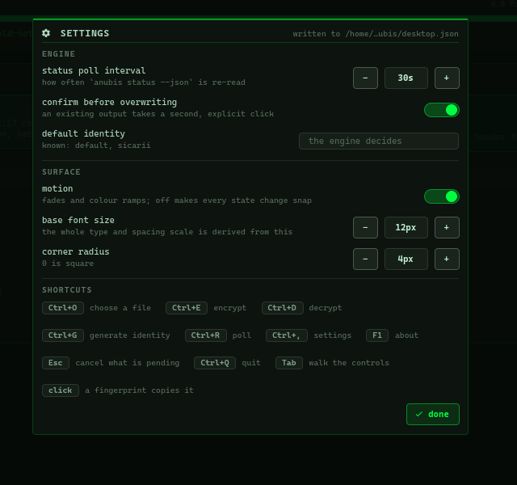
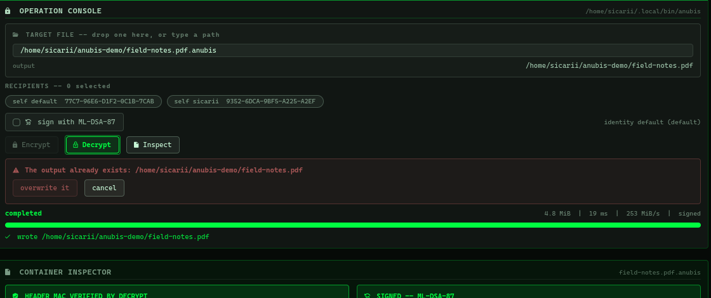

# ANUBIS Vault

A standalone desktop application for post-quantum file encryption: hybrid
X25519 + ML-KEM-1024 key encapsulation, ML-DSA-87 signatures, and
ChaCha20-Poly1305 STREAM payloads.

It grew out of the `khephri.anubis` Omarchy shell plugin: the full-screen
cockpit that plugin used to carry, lifted out of its host and given a window of
its own. The plugin ([`../plugin/khephri.anubis`](../plugin/khephri.anubis)) is
now a bar readout that hands every state-changing operation to this
application.


```
CMakeLists.txt      build, install rules
install.sh          build + install + refresh desktop databases
src/
  main.cpp          QGuiApplication, single instance, CLI argument
  app.{hpp,cpp}     engine location, clipboard, settings, palette
  process.{hpp,cpp} asynchronous child process
  datastream.{hpp,cpp} stdout/stderr sinks -- collector and line splitter
  fileview.{hpp,cpp}   watched file
qml/
  Main.qml          the window
  Vault.qml         the cockpit
  Service.qml       the engine driver
  Model.js          pure helpers -- formatting, parsing, tone mapping
  Color.qml         the palette   (singleton)
  Style.qml         the metrics   (singleton)
packaging/          desktop entry, icon, MIME type, AppStream, PKGBUILD
```

## What it is

The application spawns the `anubis` binary, reads its JSON, and draws it. It
holds no key material, derives no secret, performs no cryptography, and reaches
no verification verdict of its own. Every cryptographic claim on screen is the
engine's own statement, carried through verbatim.

That boundary is the design, not an implementation detail. The GUI process
never sees a private key, so a bug in the QML cannot leak one.

## Installing

The engine first — the application can do nothing without it. From this
repository:

```
cargo install --path ../crates/anubis-cli
```

or without a checkout:

```
cargo install --git https://github.com/AnubisQuantumCipher/anubis anubis-cli
```

Then the application:

```
./install.sh              # into ~/.local
./install.sh /usr/local   # system-wide
```

That builds, installs, and refreshes the desktop databases. Afterwards:

- **ANUBIS Vault** is in the app launcher. Bind a key if you like -- on
  Hyprland: `bind = SUPER SHIFT, V, exec, anubis-desktop`.
- `.anubis` containers carry their own icon and open here on double-click.
- With the `nautilus-python` loader installed, Nautilus grows three
  right-click items: *Encrypt with ANUBIS…*, *Encrypt to myself*, and
  *Decrypt with ANUBIS*.

Shell completions come from the engine, not from this app: the Arch package
installs them, and `anubis completions <shell>` prints them anywhere else.

`packaging/PKGBUILD` builds an Arch package instead.

Build dependencies: `qt6-base`, `qt6-declarative`, `qt6-svg`, `cmake`.
A `xdg-desktop-portal` backend gives the native file chooser; without one,
paths can still be typed or dropped.

## Running

```
anubis-desktop                    # open the vault
anubis-desktop path/to/file       # open it with that file loaded
```

A second launch does not open a second window. It hands its argument to the
instance already running and exits, so a file manager's *Open with* never ends
up with two vaults polling one engine.

| Key | Action |
| --- | --- |
| `Ctrl+O` | choose a file |
| `Ctrl+E` | focus the target field to encrypt |
| `Ctrl+D` | focus the target field to decrypt |
| `Ctrl+G` | focus the identity-name field |
| `Ctrl+R` | poll the engine now |
| `Ctrl+,` | settings |
| `F1` | about |
| `Esc` | cancel what is pending -- a sheet, an overwrite prompt, an operation |
| `Ctrl+Q` | quit |
| `Tab` | walk the controls; the focused one shows a ring and fires on Enter or Space |

The same legend is rendered in the settings sheet (`Ctrl+,`), under
**SHORTCUTS**. It used to sit at the bottom of the cockpit; reference material
read once should not pay rent in screen space, so the footer now carries only
the assurance line.

Clicking a fingerprint copies it. Clicking `copy key` copies the full recipient.
Clicking the brand opens the about sheet.

## From the file manager

Right-click any file in Nautilus:

| Item | What it does |
| --- | --- |
| **Encrypt with ANUBIS…** | Opens the file here, so you choose recipients. Encryption needs a recipient, and choosing one is a decision rather than a default. |
| **Encrypt to myself** | Runs the engine directly against this machine's own identity. Offered only when an identity exists. Never passes `--force`: an existing output is the engine's to refuse. |
| **Decrypt with ANUBIS** | Opens the container here, so you see the header, the signature and the overwrite gate before anything is written. |

The extension performs no cryptography. It resolves the engine **by content**,
not by filename — see below — and spawns it.

## Two programs called `anubis`

There is an unrelated *Anubis language* toolchain that shares the name and one
of the extensions. Both this application and the bar plugin therefore identify
a candidate engine before driving it: they run `<candidate> --help`, which
parses arguments and nothing else, and accept it only if it reports itself as
post-quantum file encryption. A different `anubis` earlier on `PATH` is
rejected and the search continues, rather than being spawned as "the engine"
and failing in a way that names no cause.

The MIME rules make the same distinction. A `.anubis` file is typed as a
container only if its content says so — either the wire-format header or the
ASCII-armored header — otherwise it is Anubis source and opens in an editor.

## The cockpit

Three rails.

- **Left — the vault.** Identity cards and the recipient address book, both
  keyed by fingerprint. Generate an identity; add or remove recipients.
- **Centre — the console.** Target file (drop or type or `Ctrl+O`), recipient
  selection, per-file signing, Encrypt / Decrypt / Inspect, live progress, and
  the container inspector.
- **Right — the record.** Counts, a log-scale activity strip, and the audit
  timeline. Clicking a timeline row loads that file into the console.

### Fingerprints are the handle

An ANUBIS recipient is roughly **2573 bech32 characters** — past the length at
which bech32's checksum still guarantees error detection. So every identity and
recipient carries an 80-bit fingerprint (SHA-256, five groups of four uppercase
hex), and that is what this surface puts in front of you. The full key is
reachable only through an explicit copy action.

There are **two fingerprint namespaces** and they are not interchangeable:

| Kind | Hashes | Answers |
| --- | --- | --- |
| `recipient` | the KEM recipient payload | who can decrypt this |
| `signer` | the ML-DSA-87 verifying key | who wrote this |

Comparing one against the other produces a falsehood, so no fingerprint is ever
drawn without its kind beside it, and each gets its own full-width line so it
can never be truncated. A truncated fingerprint is worse than none: it invites
exactly the mistaken-identity error the fingerprint exists to prevent.

### What the colours mean

- **Urgent** means *authentication failed* — a header MAC that did not verify,
  a signature that did not check out, an operation that died. Nothing else is
  allowed to borrow it.
- **Accent** means *verified* — and only when the engine actually verified
  something. A header nobody could check leaves the card neutral rather than
  taking an unearned pass.
- **Neutral** covers *unknown* and *not applicable*, including a container from
  an older, unsupported wire format. An old file is not a tampered file.


A signature's presence and its validity are separate claims, and the inspector
keeps them separate: a container is `SIGNED -- NOT VERIFIED HERE` until a check
actually runs. Verifying needs no key, so the button is offered even for a
container this vault cannot decrypt.


### The header MAC

`anubis inspect` always reports `header_mac_ok: null`, and that is by design:
the MAC key is derived from the file key, so only a recipient can check it and
`inspect` never decrypts. The Inspector says **HEADER MAC NOT DETERMINABLE
HERE** — not a pass, not a failure.

A successful **decrypt** is only reachable *after* the MAC has been checked, so
its result carries `header_mac_ok: true`. When that happens the Inspector
promotes the chip to **HEADER MAC VERIFIED BY DECRYPT** for that exact
container, and says when the check ran. The claim is about a check that
happened, not about the file's general trustworthiness. It is session state and
is never persisted.

“Exact container” means a `content_id`: SHA-512 over every decoded binary byte,
including the signature trailer. Inspect, verify, and decrypt return the same
ID for the same bytes. Attestations are indexed by that ID, never by pathname,
and a signature attestation additionally retains the signer fingerprint. An
older engine that omits or malforms the ID may still supply header metadata,
but the Vault shows an upgrade notice and refuses to promote a cached verdict.

When an already verified container is decrypted, the Vault passes both its
signer and `content_id` back to the engine. The engine re-checks them before
publishing plaintext, so replacing the path after inspection—even with a
different valid container from the same signer—fails closed.

## Settings



`Ctrl+,`, or the gear in the header. Written to
`~/.config/anubis/desktop.json`, which is watched: an edit made in a text
editor lands on the surface without a restart.

| Key | Type | Default | Meaning |
| --- | --- | --- | --- |
| `pollIntervalSec` | integer 5–600 | `30` | how often `anubis status --json` is re-read |
| `confirmOverwrite` | boolean | `true` | require a second click when the output exists |
| `defaultIdentity` | string | `""` | identity used when none is chosen; empty means the engine decides |
| `motionEnabled` | boolean | `true` | fades and colour ramps; off makes every state change snap |
| `fontBaseSize` | integer 8–24 | `12` | the whole type and spacing scale derives from this |
| `cornerRadius` | integer 0–16 | `4` | 0 is square |
| `spacingScale` | number | `1.0` | gutters, independent of type size |
| `fontFamily` | string | `monospace` | the surface expects a Nerd Font for its glyphs |
| `window` | object | — | remembered size, written on close |
| `theme` | object | — | overrides `foreground` / `background` / `accent` / `urgent` / `muted` |

Every control commits the moment it changes. There is no Apply button, because
a settings sheet with a pending state has two answers to "what is the poll
interval" and only one of them is true.

## Theme

The palette comes from the desktop's current theme
(`~/.local/state/omarchy/current/theme/colors.toml`) when there is one, so the
vault looks like the rest of the machine. A `theme` block in the settings file
overrides any of it. With neither, a dark fallback palette is used.

Only four colours are read — `foreground`, `background`, `accent`, `urgent`
(plus `muted`) — because `urgent` carries a specific meaning here and a wider
palette would make that claim cheaper.

## Engine contract

Every call passes a real input path and an explicit `--output`; the engine reads
no stdin and writes no payload to stdout, so nothing here pipes. `--identity`
has no short form.

```
anubis status    --json
anubis keygen    --json --name <NAME>
anubis inspect   --json <FILE>
anubis verify    --json [--signer <FINGERPRINT>] <FILE>
anubis encrypt   --json -r <KEY> [-r ...] [--sign] [--identity <NAME>] -o <OUT> [--force] <INPUT>
anubis decrypt   --json [--identity <NAME>] [--require-signature]
                 [--signer <FINGERPRINT>] [--expect-content-id <SHA512_HEX>]
                 -o <OUT> [--force] <INPUT>
anubis recipient list   --json
anubis recipient add    --json --label <LABEL> <KEY>
anubis recipient remove --json --label <LABEL>
```

Encrypt and decrypt stream zero or more `{"kind":"progress"}` records and then
exactly one `{"kind":"result"}`. Progress is throttled to roughly one record per
4 MiB, so small files emit none at all — the bar shows an indeterminate sweep
labelled `working` rather than claiming a percentage the engine never reported.

The process exit status and the structured record must both report success.
An exit without exactly one complete result is a failure, even when its numeric
exit code is zero. Stream collectors and partial-line parsers are reset before
every launch, and cancelled inspections are generation-bound and queued until
the previous child has actually exited.

The address book is read and written only through the engine, so there is one
parser and no write race with a concurrent CLI invocation.

`verify` is the one call that needs no key: the signature covers a digest of
the header and the payload ciphertext, so the vault can check a container it
cannot decrypt. That is why the inspector reports a signature's presence and
its validity as separate states, and only promotes the chip once a verify has
actually run over those exact bytes.

`anubis` is the only binary this program executes. Locating the engine, testing
whether an output already exists, and putting a recipient on the clipboard are
direct calls rather than the `sh`, `test`, and `wl-copy` subprocesses the shell
plugin used.

## What the engine writes, and with what permissions

| Path | Mode | Why |
| --- | --- | --- |
| ciphertext output | `600` | created at mode, not chmod-ed after, so there is no window in which it is readable under a loose umask |
| plaintext output | `600` | plaintext from a decryption tool is sensitive by default |
| `~/.config/anubis/identities/*.key` | `600` | private key material |
| `~/.config/anubis/recipients.toml` | `600` | public keys, but the address book is still yours |
| `~/.local/state/anubis/audit.jsonl` | `600` | no key material, but every path you have ever encrypted |

Every temporary is created with `create_new` at `0600`, which refuses to follow
a symlink somebody planted at the predictable temp path, and is `fsync`ed
before the rename — so a full disk fails loudly instead of leaving a container
that exists and cannot be decrypted.

## Honesty rules this surface keeps

- A field the engine did not state renders as *not stated*, never as a pass.
- A failed poll clears the status rather than leaving the last good one on
  screen — a dead binary must not go on asserting that everything is fine.
- Refusals are shown verbatim, and pre-flight refusals happen before any
  subprocess is spawned.
- Overwriting an existing file always takes a second, explicit click.

  
- Quitting while an operation runs is asked about, not assumed; the prompt says
  what will be left on disk.
- The assurance line is pinned outside every scroll area, because it is the
  line that must never be scrolled away.
- Algorithm-standard chips are rendered as standards, alongside explicit
  `PQ CATEGORY 5` and `NOT FIPS 140-3 VALIDATED` state from the engine. A FIPS
  publication number is never rendered as a module-validation claim.
- The assurance fields use a versioned status schema. A pre-assurance engine
  remains usable during a non-atomic upgrade, but its validation chip reads
  `FIPS 140-3 STATUS NOT STATED`; partial or unknown assurance schemas are
  rejected. An unexpected positive validation field renders
  `FIPS 140-3 STATUS REFUSED`; positive display code is added only through a
  future evidence-backed schema review.
- **The cipher suite is never guessed.** When the engine has not stated one the
  surface says `SUITE NOT STATED`, in the neutral tone. It used to fall back to
  a hardcoded X25519 + ML-KEM-1024 / ML-DSA-87 with FIPS 203 and 204 chips —
  painted in the accent colour that here means *verified* — after every failed
  poll, and over a binary that could not execute at all. Guessing a cipher
  suite is the one guess an encryption tool must never make.

Operations are appended by the engine to `~/.local/state/anubis/audit.jsonl`.

## Licence

MIT OR Apache-2.0
