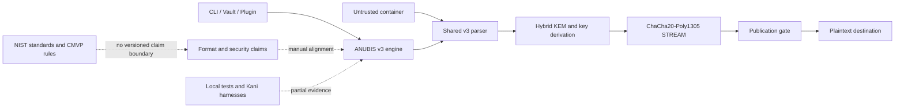
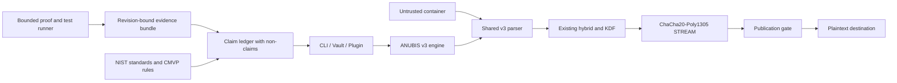
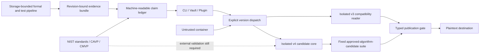
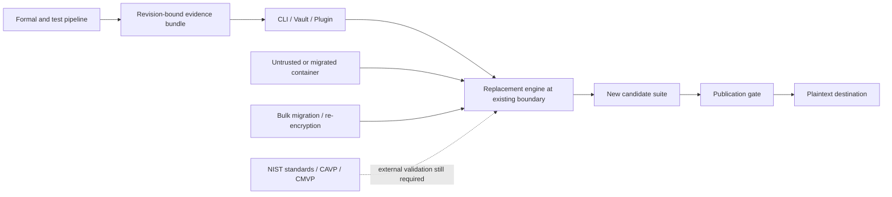

# Security Hardening Proposal: Truthful Machine-Verifiable Assurance

## Decision

We need to decide where ANUBIS will own the relationship between its wire
format, cryptographic suite, implementation invariants, formal evidence, and
NIST-facing claims. The choice is not whether to “prove FIPS.” That phrase
conflates two different systems: NIST post-quantum security categories and the
CMVP validation process for cryptographic modules.

The proposal presents the complete option set before recommending one:

- **Option 1: Evidence-harden ANUBIS/v3 in place.** Keep the current wire suite
  and add a revision-bound claim ledger, formal checks, differential tests, and
  storage-bounded evidence retention.
- **Option 2: Add an isolated ANUBIS/v4 approved-algorithm-candidate core.**
  Preserve v3 compatibility, put new writes behind an explicit version, and
  build a small candidate core whose suite and proof obligations are fixed by
  that version.
- **Option 3: Replace the current engine and migrate in place.** Collapse onto
  one new implementation and require existing data and integrations to move.

The decision proposed here is Option 2, with Option 1's evidence discipline
applied to both v3 and v4. This is an implementation-ready architectural choice,
not a claim that v4 already exists or that any resulting module is validated.

## Executive Recommendation

I recommend **Option 2: Add an isolated ANUBIS/v4 approved-algorithm-candidate
core** under the current compatibility and assurance constraints. It is the only
option that gives us a clean, immutable algorithm and state-machine boundary
without stranding existing ciphertext. It also gives reviewers a precise noun:
“the v4 candidate core at this revision,” rather than an ambiguous claim about
the whole desktop application, every dependency, and every historical format.

**Option 1: Evidence-harden ANUBIS/v3 in place** remains the fastest route to
better truthfulness. Its strongest quality is that we can attach proofs and
tests to code users already have, with no data migration or runtime-format
change. Its limit is just as important: v3 specifies ChaCha20-Poly1305, and the
current [SP 800-140C approved-functions boundary](https://csrc.nist.gov/projects/cryptographic-module-validation-program/sp-800-140-series-supplemental-information/sp800-140c)
does not make the complete v3 suite an approved-mode candidate. Formal checks
can substantiate software properties, but they cannot alter that algorithm
boundary.

**Option 3: Replace the current engine and migrate in place** makes the strongest
long-term case for simplicity. Once migration finishes, the team owns one
engine and one active suite. What gives me pause is the transition: changing
cryptographic semantics under the v3 version line would be dishonest, while
changing them honestly forces a format break and bulk migration. For encrypted
user data, that creates avoidable availability and rollback risk.

NIST's categories must remain exact in every option. [FIPS 203](https://csrc.nist.gov/pubs/fips/203/final)
places ML-KEM-1024 in security category 5, and [FIPS 204](https://csrc.nist.gov/pubs/fips/204/final)
places ML-DSA-87 in category 5. [FIPS 140-3](https://csrc.nist.gov/pubs/fips/140-3/final)
defines four qualitative module security levels, not a fifth level. The
[CMVP](https://csrc.nist.gov/Projects/cryptographic-module-validation-program)
requires testing by an accredited Cryptographic and Security Testing laboratory
and review by the validation authority. Neither source-level formal proof nor
successful local testing substitutes for that external process.

## Evidence

I inspected the sealed finding registry, its threat model and limitations, the
post-scan remediation report, and the v3 format, security policy, proof
harnesses, and CI at starting revision
`f7f37f17cf4be68c49431df91f8d6c7a24d8a993`. The evidence that most influenced
the diagnosis was not one cryptographic primitive failure. It was the repeated
pattern of a security assertion being owned in one place and relied on in
another.

The scan is bound by manifest SHA-256
`708fd251769ef4ac5ca86edd81b061092c0376c841aa0b0821bed282983639f1`
at source revision `8e26122fec7a94afca425abffa2d2c146ce241de`.
The remediation report states that the findings below were fixed and tested
before the implementation starting revision. They remain evidence of the
structural recurrence risk; this proposal does not claim they are still open.

| Evidence | Finding or document | What it establishes |
| --- | --- | --- |
| `csf_61ce296e94ea8662ff9ffb8b` | The public decrypt API writes plaintext before sender-signature verification | Safe publication was not originally enforced at the public API boundary. |
| `csf_eae655e2268c2ff7817b9e6e` | Desktop subprocess collectors reuse stale security verdicts | Evidence lifetime could exceed operation lifetime. |
| `csf_76db625f533baa8783a78614` | Vault authentication attestations are bound only to filenames | Trust state was not bound to immutable content and policy. |
| `csf_588ce26089cdbc4ef10bd7d0` | Global JSON mode corrupts payloads written to stdout | Data and control protocols lacked an enforced channel boundary. |
| `csf_56b1cb1233c54e1d461d5460` | Cancelling an inspection can bind the old result to the new path | Operation generation and target identity were not one atomic state. |
| `csf_0d5b21a23ecc3a280a0b5da0` | Key strings use Bech32m while the format requires Bech32 | Normative text and implementation changed without an explicit version migration. |
| `csf_ccbaf15b9000aaed3501ad63` | Degenerate X25519 keys silently remove the classical hybrid contribution | The claimed hybrid invariant needed enforcement at contribution boundaries. |
| `csf_0f08d88ff87f4bec498a3cba` | Unforced output can overwrite a file created after the no-clobber check | Policy and the dangerous publication operation were split. |
| `csf_58df7fb1d2a76abf92e202fc` | Selected I/O failures leave named plaintext or key temporaries | Secret-file lifetime was governed by scattered cleanup paths. |
| `csf_5cc259216333671f3a069613` | Expanded post-quantum secret keys are not zeroized on drop | Secret-erasure behavior depended on dependency features outside the type boundary. |
| `csf_9d9df46d6643ed55c167c261` | Rust accepts signed structures rejected by the normative verifier | Multiple structural validators drifted apart. |
| `csf_e1639c7a9aa4324d05ea5051` | Encryption can create containers its own reader refuses | Reader and writer geometry lacked one invariant owner. |
| `csf_92c997b27c890dde4bd90842` | Binary inspect buffers an unknown-length stream without a bound | A constant-memory claim omitted one unbounded path. |
| `SRC-FORMAT-V3` | `docs/FORMAT.md` — ANUBIS/v3 format | Observed: v3 fixes X25519 plus ML-KEM-1024, ML-DSA-87, ChaCha20-Poly1305, HKDF-SHA-512, HMAC-SHA-512, and a textual wire grammar. |
| `SRC-SECURITY` | `docs/SECURITY.md` — security policy | Observed: the project explicitly disclaims a third-party cryptographic audit and identifies project-owned composition as the concentrated risk. |
| `SRC-PROOFS` | `crates/anubis-crypto/src/{armor,format,stream}.rs` — Kani harnesses | Observed: bounded-model harnesses cover parser panic freedom, arithmetic, geometry, and nonce construction, but the starting revision's CI does not run them. |
| `NIST-FIPS-203` | FIPS 203 — ML-KEM | Observed: ML-KEM-1024 is security category 5; conformance to an algorithm standard alone does not ensure implementation or system security. |
| `NIST-FIPS-204` | FIPS 204 — ML-DSA | Observed: ML-DSA-87 is security category 5; the standard likewise distinguishes algorithm conformance from implementation security. |
| `NIST-FIPS-140-3` | FIPS 140-3 — cryptographic modules | Observed: module requirements span interfaces, roles, sensitive-parameter management, self-tests, lifecycle assurance, physical and operating-environment controls, and four qualitative security levels. |
| `NIST-CAVP-CMVP` | NIST CAVP and CMVP program rules | Observed: algorithm validation is a prerequisite, not a substitute, for module validation; production certificates require the program's laboratory and authority workflow. |

From these observations, we can reasonably infer that ANUBIS needs a single
versioned assurance boundary. The scan does not prove that a v4 design would be
secure, and a diagram does not fix the historical findings. The inference is
narrower: dispersed ownership made claim drift possible, and an isolated core
plus revision-bound evidence would make that drift easier to prevent and detect.

## Current Design And Failure Mode

At the starting revision, CLI, Vault, and plugin workflows ultimately rely on
the v3 engine and its textual version line. The v3 format deliberately fixes a
suite rather than negotiating algorithms. That is a sound anti-downgrade
property, but it also means the suite and the version are inseparable:
ChaCha20-Poly1305 is not an interchangeable implementation detail. Replacing it
while continuing to call the bytes v3 would make conforming implementations
disagree.

The current architecture contains several useful controls. The parser is
bounded, writer and reader geometry are shared after remediation, hybrid
contributory behavior is checked, safe decrypt APIs stage output, and security
attestations are content-bound. The Kani harnesses demonstrate that a small
pure core can already support exhaustive bounded checks. We should preserve
those controls instead of treating a new format as permission to rewrite from
scratch.

The remaining architectural failure mode is epistemic and lifecycle-oriented:
claims do not yet have one machine-readable owner. A README sentence, a format
requirement, a Kani harness, a CI result, and a desktop badge can each be true in
isolation while referring to different revisions, paths, or scopes. Similarly,
“uses FIPS 203” can be true of an algorithm choice while “FIPS validated” remains
false of the module. If we do not encode that distinction, proof volume can
increase while assurance clarity gets worse.

There is also a resource failure mode. Model checking and symbolic protocol
analysis can retain large build directories, SAT/SMT artifacts, traces, and
generated vectors. Treating every intermediate as permanent evidence will
eventually consume the workstation. Evidence retention must therefore be a
security and reliability control, not an afterthought: runs start only after a
free-space and quota preflight, scratch is disposable, and retained bundles are
small enough to inspect and reproduce.

## Desired Invariants

- Every container selects exactly one format and suite from an authenticated,
  canonical version boundary; no algorithm negotiation or fallback can silently
  weaken that selection.
- Every v3 container that is valid at the compatibility baseline remains
  decryptable and verifiable by the compatibility reader unless an explicitly
  documented security refusal applies.
- New v4 encryption never emits a v3 version line, and the v3 reader never
  interprets v4 bytes as v3.
- Untrusted bytes cross one strict structural validator before cryptographic or
  publication state is promoted.
- Plaintext becomes publishable only after all required payload, header,
  signature, signer-policy, content-identity, and format checks reach a terminal
  success state.
- Every claimed hybrid contribution is either accepted as contributory and
  transcript-bound or the operation fails; any non-approved auxiliary
  contribution is labeled as such and never used to inflate an approved-mode
  claim.
- Secret types own destruction behavior, and CI verifies dependency features
  that participate in that behavior.
- Every assurance statement names its format version, source revision, tool
  version, proof or test identifier, assumptions, status, and non-claims.
- A formal result never implies properties outside its model or consequence
  ceiling, and never implies CAVP or CMVP validation.
- Proof execution is storage-bounded: preflight checks enforce an
  operator-configured quota, all heavy intermediates live in disposable scratch,
  and only compact content-addressed evidence survives cleanup.
- A failed, cancelled, or out-of-space proof run cannot overwrite the most
  recent valid evidence bundle or be reported as a pass.

## Constraints And Non-Goals

We must preserve v3 user data, the CLI/Vault/plugin surfaces, and the remediated
publication and attestation safeguards. We assume a balanced engineering
profile because no measured runtime or proof-storage budget was supplied. We
also assume the project can carry a compatibility reader for a meaningful
migration window.

This proposal does not design the final v4 wire format, prove the hybrid
combiner, certify dependency implementations, validate the operating
environment, or claim side-channel resistance. It does not make the desktop or
plugin a sandbox. It does not promise that deletion reliably erases data from
all filesystems or storage media. It does not replace independent validation
with “enough” formal proofs; no accumulation of local artifacts crosses that
program boundary.

The initial candidate suite is a design target, not a completed security
specification: ML-KEM-1024, ML-DSA-87, AES-256-GCM payload protection, an
approved key-wrap mechanism such as AES Key Wrap, and approved SHA-2/HMAC/KDF
functions. The classical hybrid contribution must be resolved as a separate
design gate against current NIST and CMVP guidance. We can select an approved
classical key-establishment method, or retain a non-approved auxiliary
contribution with explicit non-claim language; we must not blur the two.

## Before Architecture

The current design has one v3 runtime boundary, while documentation, proof
harnesses, CI results, and NIST-facing language are related mostly by human
review. The important weakness in this view is not that controls are absent; it
is that the evidence and claim edges are not versioned runtime inputs.

[Before architecture](../diagrams/truthful-machine-verifiable-assurance-before.mmd)

The manual-alignment edges explain why more tests alone are insufficient. We
need to know which code and suite a result covers and what it explicitly does
not establish.

## Options

### Option 1: Evidence-Harden ANUBIS/v3 In Place

This option preserves every runtime and wire boundary. We add a claim ledger
that describes v3 precisely, execute the existing Kani harnesses in CI, expand
the pure-state proof surface, keep differential format vectors, and publish a
revision-bound evidence manifest. The runtime stays familiar: the same parser,
hybrid combiner, ChaCha20-Poly1305 stream, and publication gate serve users.

The strongest case for Option 1 is immediate assurance value with almost no
compatibility risk. It directly addresses overstatement: the ledger can say
that ML-KEM-1024 and ML-DSA-87 are category 5 parameter sets while the overall
v3 product is not CMVP validated. It can distinguish parser panic-freedom from
protocol secrecy, model-checked arithmetic from primitive correctness, and a
passing test from an exhaustive proof. These distinctions make future review
faster and safer.

Security improves through detection, not through a new cryptographic boundary.
Kani can prove bounded Rust properties in the modeled code, differential tests
can detect implementation divergence, and the claim checker can reject stale
evidence. The current v3 suite and its residual composition assumptions remain.
In particular, this option cannot truthfully become an approved-algorithm mode
merely by adding proof artifacts. The full module also remains outside CMVP
without the external validation process.

Runtime performance and memory should be unchanged because the evidence path is
offline. CI time and local proof resource use grow. The mechanism for bounding
that cost is explicit: the runner uses a temporary `CARGO_TARGET_DIR` and solver
workspace, checks free space against an operator-set ceiling before starting,
retains only manifests, summaries, compact counterexamples, and compressed
logs, and deletes intermediates on every terminal path. We should measure proof
wall time, peak scratch bytes, retained bundle bytes, and cleanup completeness
against the same revision before making scheduling promises.

Rollout is reversible. The ledger and proof jobs can initially be advisory, then
become required once they are stable. Rollback removes an evidence gate but does
not alter ciphertext or runtime semantics. The tactical remediations remain
mandatory because the formal layer does not substitute for their concrete code.

[Option 1 after architecture](../diagrams/truthful-machine-verifiable-assurance-v3-evidence-only-after.mmd)

| Change | Before | After | Security consequence | Cost |
| --- | --- | --- | --- | --- |
| Claim ownership | Prose and code linked by review | Machine-readable ledger names suite, revision, evidence, assumptions, and non-claims | Stale or over-broad claims can fail CI | Ledger maintenance and schema review |
| Formal checks | Harnesses exist outside starting CI | Bounded checks are reproducible CI gates | Modeled invariant regressions are detected | Longer CI and solver/toolchain maintenance |
| Proof storage | Tool defaults and developer cleanup | Quota preflight, disposable scratch, compact retained bundle | Out-of-space runs fail closed and do not corrupt prior evidence | Runner and retention tooling |
| Wire/runtime | v3 fixed suite | Unchanged | No new runtime attack surface | No path toward an approved-algorithm candidate suite |

The meaningful delta is epistemic: we know more exactly what v3 evidence says.
If near-term compatibility and delivery dominate every other priority, this
option is proportionate and should win.

### Option 2: Add An Isolated ANUBIS/v4 Approved-Algorithm-Candidate Core

Option 2 makes the assurance boundary an architectural component. An explicit
version dispatcher sends v3 input only to the frozen compatibility reader and
v4 input only to a small candidate core. New v4 bytes carry a distinct version
line and fixed suite identifier. The shared outer API returns typed inspection,
verification, and publication states rather than loose booleans or path-bound
claims.

The attractive part of this design is that we can reason locally. The v4 core
owns canonical parsing, reader/writer geometry, suite selection, transcript
construction, nonce allocation, and the transition from provisional to
publishable plaintext. Its pure transition functions can be model checked
without invoking filesystems or heavyweight primitive implementations. The
production adapters still need tests, differential vectors, and source review;
we do not pretend a pure model proves foreign I/O or dependency internals.

The initial suite target replaces v3's payload and wrap choices with current
approved-algorithm candidates: AES-256-GCM for payload protection, an approved
AES key-wrap construction for the file key, SHA-512/HMAC/HKDF where the
applicable NIST profiles permit them, ML-KEM-1024 for post-quantum key
establishment, and ML-DSA-87 for signatures. The classical hybrid component is
an explicit specification gate. We either select an approved classical
key-establishment method and prove both contributions are transcript-bound, or
retain an auxiliary non-approved contribution and ensure every claim says the
approved strength comes from the approved component. We do not choose silently
based on provider availability at runtime.

This candidate language matters. [CAVP](https://csrc.nist.gov/Projects/Cryptographic-Algorithm-Validation-Program)
states that successful algorithm validation is a prerequisite to module
validation and also that implementing approved functions does not itself meet
FIPS 140 module requirements. The v4 boundary can be shaped to make future
testing and documentation tractable—fixed algorithms, explicit services,
self-test hooks, known-answer-vector adapters, and a small dependency surface—
but it remains unvalidated unless the exact implementation enters the formal
program.

Compatibility is additive. The v3 reader remains available, and the v3 writer
can remain behind an explicit compatibility choice while v4 matures. The CLI,
Vault, and plugin must display the actual format and assurance profile. They
must never promote “v4 candidate” to “FIPS validated,” and downgrade from a
requested v4 write to v3 must be an error rather than fallback. A default-format
change happens only after interoperability, recovery, and rollback criteria
pass.

The runtime cost is real but manageable. AES-GCM performance will vary by CPU
and provider, v4 may carry different header and recipient overhead, and the
dispatcher plus compatibility code increases binary and maintenance size.
Memory can remain bounded if chunk and parser limits are fixed. Reliability
improves through failure containment between versions, but the project now owns
two readers and migration policy. We need measured file/pipe benchmarks across
representative sizes, recipient sets, hardware classes, and signed/unsigned
paths before changing defaults.

Formal evidence follows the same storage policy as Option 1, with a stricter
separation: proof models and generated vectors build in disposable workspaces;
retained bundles contain source/tool digests, obligations, results,
counterexamples, and compressed logs. Content-addressing avoids duplicate
retention, while the operator's byte quota—not an ever-growing history—sets the
hard ceiling. A failed cleanup or insufficient-space preflight blocks the proof
status from becoming current.

Rollout is staged and reversible because v3 data is never rewritten
automatically. If v4 is disabled, existing v4 fixtures and any explicitly
created v4 files remain readable by the last known-good v4 reader; the default
returns to v3 only through an explicit policy change. If a v4 cryptographic flaw
appears, new writes stop, evidence is revoked for affected revisions, and data
owners choose re-encryption rather than the application silently transforming
their ciphertext.

[Option 2 after architecture](../diagrams/truthful-machine-verifiable-assurance-additive-v4-candidate-after.mmd)

| Change | Before | After | Security consequence | Cost |
| --- | --- | --- | --- | --- |
| Version boundary | One v3 engine and suite | Exact dispatch to isolated v3 and v4 cores | No silent reinterpretation or downgrade between suites | Parallel-reader maintenance |
| Candidate algorithms | v3 ChaCha20-Poly1305 suite | Fixed v4 approved-algorithm-candidate suite | Creates a tractable candidate boundary; does not create validation | New specification, dependencies, vectors, and benchmarks |
| State ownership | Controls span parser, crypto, CLI, and UI | Typed core states gate attestation and publication | Invalid promotion paths become easier to exclude and prove | API migration across all surfaces |
| Formal model | Harnesses embedded in selected modules | Pure v4 model plus refinement/differential checks | Stronger evidence for modeled transitions and geometry | Proof maintenance and model/code correspondence work |
| Proof storage | Unbounded tool defaults are possible | Quota-enforced disposable scratch and compact evidence | Prevents assurance work from exhausting the host | Cleanup, quota, and observability tooling |
| Compatibility | Existing v3 behavior | v3 reader preserved; v4 writes explicit | Existing ciphertext remains recoverable | Larger long-term support surface |

The key after-edge is the explicit dispatcher. It lets us freeze v3 semantics,
reason about v4 independently, and make every user-facing assurance statement
name the version it actually covers.

### Option 3: Replace The Current Engine And Migrate In Place

This option retires the current engine rather than carrying a compatibility
boundary. We introduce the candidate suite across the existing public surface,
re-encrypt stored data, update integrations, and remove v3 support after a
defined migration period. The strongest case is architectural economy: once
the old world drains, there is one parser, one active suite, one proof model,
and less long-term opportunity for compatibility code to become an unreviewed
security island.

We should treat that strongest case seriously. Duplicate cryptographic readers
do cost review time, and old formats can outlive their original threat models.
If ANUBIS had no deployed ciphertext or every data owner already had verified
plaintext backups, an in-place program could be reasonable. It may also become
preferable later if v3 usage reaches an observed retirement threshold and v4
recovery has been exercised broadly.

Today, however, the migration mechanism dominates the risk. We cannot change
the suite under `anubis-encryption.org/v3` without creating parser differentials
by design. If we introduce an honest new version but remove the old reader, all
existing ciphertext must be decrypted and re-encrypted. That process handles
plaintext, requires every relevant private identity to remain available, can
fail between source verification and destination publication, and creates a
new backup/rollback problem. An interrupted migration must preserve the old
container until the new container is independently verified; otherwise a
hardening effort can become a data-loss event.

Formal verification is simpler only after migration finishes. During rollout,
the migration tool, old and new parsers, filesystem publication, inventory,
resume logic, and backup policy all join the trusted transition boundary. CI
storage can still be bounded exactly as in the other options, but operational
storage temporarily increases because safe migration retains old and new
ciphertext until verification and user acceptance. No source-derived storage
or migration-volume measurements are available, so it would be irresponsible
to call that cost small.

Rollback is also less clean. Code can be reverted, but data already converted
to a new format requires the old v4-capable binary or another verified reader.
That is a material asymmetry compared with the additive option. I would be
comfortable revisiting Option 3 only after an inventory proves the deployed v3
population is disposable or fully recoverable and the project explicitly
accepts the migration storage and availability envelope.

[Option 3 after architecture](../diagrams/truthful-machine-verifiable-assurance-in-place-replacement-after.mmd)

| Change | Before | After | Security consequence | Cost |
| --- | --- | --- | --- | --- |
| Active engine | v3 engine | Replacement candidate engine | Reduces long-term duplicated control ownership | High transition concentration risk |
| Existing ciphertext | Directly readable | Must be migrated or becomes unreadable | Old format can eventually be retired | Plaintext exposure window, identity availability, backup, and recovery work |
| Wire identity | Stable v3 semantics | New semantics require honest new versioning | Avoids permanent suite ambiguity only if version changes | Integration break and coordinated rollout |
| Formal scope | Existing harnesses and remediated code | New core plus migration state machine | Potentially smaller steady-state proof surface | Largest proof surface during migration |
| Rollback | Revert code | Revert code and preserve a reader for converted data | None unless dual recovery is maintained | Operationally asymmetric rollback |

The diagram looks simpler because it hides the temporary dual world inside
“bulk migration.” That node is precisely the part we cannot dismiss; it carries
the plaintext and availability risk that makes this option inferior today.

## Comparison

No runtime or proof-resource measurements were supplied, so this comparison
uses source-derived or hypothetical directions and names what must be measured.

| Dimension | Option 1: v3 evidence-only | Option 2: additive v4 candidate | Option 3: in-place replacement |
| --- | --- | --- | --- |
| Security | **Improves**, high confidence, source-derived: detects claim and modeled-invariant drift; v3 suite remains. | **Improves**, medium confidence, source-derived: isolates version, suite, and state ownership; new design risk remains. | **Unknown**, medium confidence, source-derived: smaller steady state but migration adds a privileged plaintext path. |
| Performance | **Neutral** at runtime, high confidence; proof CI grows. | **Unknown**, medium confidence; AES/provider, header, and dispatch costs need file/pipe benchmarks. | **Unknown**, low confidence; steady state may simplify, migration throughput and downtime dominate. |
| Memory | **Neutral** at runtime, high confidence; proof scratch is quota-bounded. | **Unknown**, medium confidence; bounded chunks are feasible, parallel code and providers increase binary footprint. | **Unknown**, low confidence; runtime may remain bounded, migration inventory and buffers need measurement. |
| Reliability | **Improves**, medium confidence: stale or failed evidence cannot promote current claims. | **Improves**, medium confidence: format failures are isolated and v3 remains recoverable. | **Regresses** during migration, high confidence: interruption, missing identities, and rollback can affect availability. |
| Operability | **Regresses slightly**, medium confidence: proof tools and ledger require ownership. | **Regresses**, high confidence: two readers, format telemetry, suite inventory, and evidence gates require operations. | **Regresses materially** during migration, high confidence: inventory, backup, resume, recovery, and incident playbooks expand. |
| Migration | **Neutral**, high confidence: no wire or API migration. | **Regresses modestly**, high confidence: additive API/version rollout while v3 stays readable. | **Regresses materially**, high confidence: data and integration migration are mandatory. |
| Reversibility | High: remove gates without touching data. | High before default switch; v4 reader must remain for created v4 data. | Low after data conversion without retained compatible readers. |
| Validation plan | Compare CI time, peak scratch, retained bundle size, and stale-evidence rejection. | Add cross-format fixtures, benchmark representative workloads, verify downgrade refusal, and test v3/v4 recovery. | Run dry-run inventory, interruption/resume, dual verification, backup restoration, and migration-capacity tests before any retirement. |

Option 2 costs more engineering and operations than Option 1, but the mechanism
of that cost is visible and reversible. Option 3's apparent steady-state
simplicity arrives only after the highest-risk transition, which is why no
composite score would be honest here.

## Recommendation

I recommend Option 2, using Option 1 as its immediate evidence foundation. We
should first make v3 claims revision-bound and storage-safe, then specify and
prototype the isolated v4 core without changing default writes. The v4 writer
becomes selectable only after the normative grammar, independent vectors,
formal obligations, and recovery behavior agree. A default change is a later
policy decision, not an automatic consequence of compiling the new code.

Option 1 should win instead if the project cannot sustain two readers or if
measured v4 runtime/resource costs exceed the operator's budget. Option 3 should
win only if a source-backed inventory shows existing v3 data can be safely and
reversibly migrated and long-term compatibility maintenance is the dominant
risk. A future CMVP requirement changes the delivery process, not the truth of
this recommendation: the exact module would still need the accredited
laboratory and validation-authority path.

## Evidence Coverage And Residual Risk

The mappings below describe architectural effect, not finding closure. Every
tactical fix reported at the starting revision remains required until the
original path is revalidated against implemented code.

| Evidence | Option 1 | Option 2 | Option 3 | Tactical fix during migration |
| --- | --- | --- | --- | --- |
| `csf_61ce296e94ea8662ff9ffb8b` — Public decrypt publishes before signature | Mitigates recurrence through a publication-state proof | Addresses the control shape in the v4 typed publication gate; v3 fix remains | Unknown until replacement and migration writers are proved and tested | Required |
| `csf_eae655e2268c2ff7817b9e6e` — Desktop collectors reuse stale verdicts | Mitigates through claim/operation evidence tests | Mitigates through typed operation evidence; UI lifecycle fix remains | Unaffected unless desktop transport is redesigned | Required |
| `csf_76db625f533baa8783a78614` — Attestations bound only to filenames | Mitigates through content-bound evidence assertions | Addresses v4 attestation type; v3 content binding remains | Unknown until replacement UI and migration evidence bind content | Required |
| `csf_588ce26089cdbc4ef10bd7d0` — JSON corrupts stdout payload | Mitigates through channel-separation tests | Mitigates through typed service outputs; CLI guard remains | Unknown in replacement interface | Required |
| `csf_56b1cb1233c54e1d461d5460` — Cancellation binds stale result | Mitigates through generation-state proofs/tests | Addresses the v4 operation state shape; process fix remains | Unknown during replacement/migration cancellation | Required |
| `csf_0d5b21a23ecc3a280a0b5da0` — Bech32/Bech32m format drift | Mitigates through spec/code differential evidence | Addresses future drift through immutable v4 encoding and explicit compatibility | Risks recurrence if replacement is not distinctly versioned | Required |
| `csf_ccbaf15b9000aaed3501ad63` — Degenerate X25519 removes hybrid contribution | Mitigates through contributory-behavior proof obligations | Addresses the candidate contribution boundary once the classical method is fixed | Unknown until replacement combiner is specified | Required |
| `csf_0f08d88ff87f4bec498a3cba` — No-clobber race | Unaffected structurally; regression tests remain | Unaffected by crypto core; shared publication adapter retains fix | Unknown in migration publisher | Required |
| `csf_58df7fb1d2a76abf92e202fc` — Sensitive temporary residue | Mitigates through lifecycle assertions; OS behavior remains tested | Mitigates through typed staging owner; platform testing remains | Risk expands during migration | Required |
| `csf_5cc259216333671f3a069613` — PQ expanded keys not zeroized | Mitigates through feature/type evidence | Addresses v4 secret-owner types; dependency internals remain an assumption | Unknown until replacement dependencies are fixed | Required |
| `csf_9d9df46d6643ed55c167c261` — Parser/verifier structural differential | Mitigates through differential and parser proofs | Addresses control ownership with one v4 structural validator | Unknown during rewrite and migration | Required |
| `csf_e1639c7a9aa4324d05ea5051` — Writer exceeds reader limit | Mitigates through shared-geometry proof | Addresses v4 with a shared checked geometry type | Unknown until replacement writer/reader model is complete | Required |
| `csf_92c997b27c890dde4bd90842` — Inspect buffers unbounded stdin | Mitigates through resource-bound regression evidence | Mitigates through bounded v4 parser contract; adapters still tested | Unknown in replacement/migration inventory | Required |

Residual risk remains substantial and must stay visible:

- Formal models can be wrong, incomplete, or fail to refine to production code.
- Kani proves bounded program properties, not primitive cryptographic security,
  protocol secrecy, constant-time execution, platform behavior, or side-channel
  resistance unless those are separately modeled and supported.
- Rust dependency implementations, compiler behavior, entropy sources,
  operating systems, filesystems, Qt, packaging, and installation remain outside
  a small pure-core proof.
- A fixed suite can still be composed incorrectly. Independent vectors and
  symbolic protocol analysis reduce risk but do not create universal proof.
- A v4 candidate that uses approved algorithms is not automatically an
  approved-mode or validated module.
- The v3 compatibility reader remains security-sensitive for as long as users
  retain v3 ciphertext.
- Storage quotas protect availability but can cause proof jobs to refuse; a
  refusal must never be reported as a pass or silently replaced by a weaker
  check.

## Migration And Rollout

The selected option begins with the evidence boundary, not with new ciphertext.
We publish a machine-readable claim ledger for v3 and make the storage-bounded
proof runner reproducible. That gives us a trustworthy place to record v4
design evidence later and tests cleanup behavior before solver volume grows.

Next, we freeze the v4 threat model and normative suite document. Version
dispatch and typed states can be introduced behind an internal feature while
all production writes remain v3. Independent fixtures must demonstrate that v3
behavior is unchanged and that v4 bytes are never accepted as v3. The candidate
writer then becomes explicitly selectable; the CLI and UI show the format and
candidate status at every trust decision.

Default-write migration happens only after interoperability, performance,
resource, recovery, and downgrade gates pass. Existing files are never
automatically rewritten. The v3 reader stays available, and any future v3
retirement requires a separate design decision with inventory and recovery
evidence.

Rollback disables new v4 writes while retaining the last known-good v4 reader.
The claim ledger marks affected evidence stale or revoked by source revision.
Because there is no automatic bulk migration, rollback does not require
decrypting and re-encrypting the user's v3 archive.

## Validation Plan

- Validate `hardening.json`, the claim ledger, and every evidence bundle against
  schemas; reject unknown required fields and stale source revisions.
- Run formatting, clippy, workspace tests, release tests, desktop CTest, QML
  lint, plugin validation, and independent verifier coverage on the refreshed
  source.
- Run every Kani harness with a pinned toolchain and explicit unwind bounds;
  record harness status, assumptions, coverage limitations, tool versions, and
  compact counterexamples.
- Add model-based tests for format dispatch, parser totality, writer/reader
  geometry, nonce uniqueness, terminal publication, downgrade refusal, and
  operation-evidence freshness.
- Maintain independent v3 and v4 parsers or vector consumers that share no
  production parser code, then require agreement on canonical fixtures and
  rejection cases.
- Add known-answer-vector adapters suitable for local CAVP-style testing, while
  labeling local vectors as conformance evidence rather than algorithm
  certificates.
- Subject the hybrid transcript and protocol state to a symbolic model with
  explicit primitive assumptions; retain the model, claims, result summary,
  and counterexamples, not the solver cache.
- Benchmark file and pipe encryption/decryption, signed and unsigned paths,
  representative recipient sets, startup, binary size, peak resident memory,
  temporary disk, proof wall time, peak proof scratch, and retained bundle size.
  Compare the same workload and host before changing defaults.
- Force low-space, quota-exceeded, cancellation, tool crash, and cleanup-failure
  cases. Verify the current valid evidence pointer is unchanged and no partial
  pass bundle survives.
- Exercise rollback by disabling v4 writes, reading existing v4 fixtures with
  the pinned reader, and continuing to read all v3 compatibility fixtures.

## Implementation Work Packages

The detailed handoff is in
[the additive v4 implementation plan](../implementation/additive-v4-candidate.md).
Its work packages are intentionally named rather than presented as another
numbered option set:

- `WP-CLAIMS`: claim schema, NIST vocabulary guard, revision binding, and
  non-claim enforcement.
- `WP-STORAGE`: proof preflight, disposable workspace, quotas, atomic evidence
  publication, cleanup, and observability.
- `WP-V3-EVIDENCE`: pin and run current harnesses, add state/geometry coverage,
  and preserve independent compatibility vectors.
- `WP-V4-SPEC`: threat model, fixed candidate suite, hybrid decision, wire
  grammar, state machine, and downgrade policy.
- `WP-V4-CORE`: isolated parser, checked representations, secret owners,
  crypto-provider boundary, and typed publication state.
- `WP-REFINEMENT`: connect pure models to production behavior with differential
  tests, generated cases, and traceable obligations.
- `WP-SURFACES`: explicit CLI/Vault/plugin format selection and truthful
  assurance presentation.
- `WP-ROLLOUT`: opt-in fixtures, benchmarks, recovery gates, default decision,
  and reversible disablement.

## Open Questions

- Which current NIST-approved classical key-establishment method, if any, should
  provide the classical half of the v4 hybrid candidate?
- If X25519 remains as an auxiliary contribution, what exact CMVP guidance and
  claim language govern that non-approved component at release time?
- Which AES-GCM nonce construction and chunk AAD transcript will the normative
  v4 specification fix, and how will the implementation prove uniqueness across
  all accepted files and chunks?
- Which approved key-wrap and KDF profiles match the final hybrid construction
  and available implementation providers?
- What operator-configured free-space floor, scratch quota, retained-evidence
  quota, and CI retention policy fit this workstation and hosted runners?
- Which formal toolchain is supportable long term, and who reviews model-to-code
  correspondence when the Rust core changes?
- How long must the v3 writer remain available after v4 opt-in, and what observed
  evidence would justify changing the default?
- Which exact module boundary would be submitted if the project later chooses
  CMVP, and which desktop/plugin functions remain outside it?
